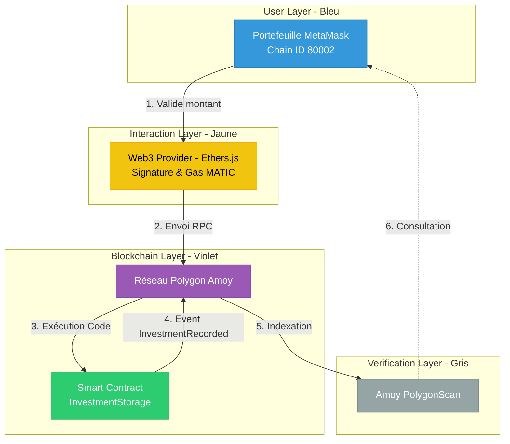

# Atelier 1 - Smart Contract de Base

## 🎯 Objectif
L'objectif de cet atelier est de comprendre les fondamentaux du développement de Smart Contracts sur la blockchain Ethereum (EVM). Nous apprenons à :
- Développer un contrat Solidity sécurisé avec **OpenZeppelin**.
- Gérer le stockage de données via des `mapping`.
- Implémenter des mécanismes de contrôle d'accès (`Ownable`).
- Manipuler des fonds (ETH/MATIC) et gérer les événements.
- Mettre en place une suite de tests automatisés avec **Hardhat** et **Chai**.

## 📋 Fonctionnalités du Contrat
Le contrat `InvestmentStorage` permet les actions suivantes :
- 💰 **Enregistrement d'Investissement** : Les utilisateurs peuvent envoyer des MATIC et enregistrer leur montant investi.
- 📈 **Suivi Cumulatif** : Les investissements multiples d'une même adresse sont additionnés.
- 👥 **Compteur d'Investisseurs** : Suivi en temps réel du nombre total d'investisseurs uniques.
- 🔍 **Consultation Publique** : N'importe qui peut vérifier le montant investi par une adresse.
- 🔐 **Retrait Sécurisé** : Seul le propriétaire peut retirer les fonds accumulés sur le contrat.
- 📢 **Événements** : Émission d'alertes pour chaque investissement et chaque retrait.

## 🏗️ Architecture
- **Language** : Solidity ^0.8.20
- **Héritage** : `Ownable` (OpenZeppelin) pour la gestion des permissions.
- **Stockage** :
  - `investments` : Mapping (address => uint256) pour les montants.
  - `hasInvested` : Mapping (address => bool) pour identifier les nouveaux investisseurs.
  - `totalInvestors` : Variable d'état pour le décompte global.

## 🚀 Installation
```bash
# Accéder au dossier de l'atelier
cd atelier1-basic-contract

# Installer les dépendances
npm install

# Créer votre fichier .env (voir .env.example)
cp .env.example .env
```

## 🧪 Tests
Les tests sont écrits en JavaScript avec Hardhat et couvrent 100% des fonctionnalités.
```bash
# Lancer tous les tests
npm test

# Compiler les contrats manuellement
npm run compile
```

## 📤 Déploiement sur Polygon Amoy
Le déploiement se fait sur le testnet **Amoy** (successeur de Mumbai).
1. Obtenez des tokens de test : [Polygon Amoy Faucet](https://faucet.polygon.technology/)
2. Configurez votre `PRIVATE_KEY` dans le fichier `.env`.
3. Déployez le contrat :
```bash
npx hardhat run scripts/deploy.js --network amoy
```

## 🔗 Liens Utiles
- **Polygon Amoy Faucet** : [https://faucet.polygon.technology/](https://faucet.polygon.technology/)
- **Amoy PolygonScan** : [https://amoy.polygonscan.com/](https://amoy.polygonscan.com/)
- **MetaMask Setup Guide** : Ajoutez le réseau Amoy manuellement dans MetaMask.
- **Détails du réseau Amoy** :
  - **Nom du réseau** : Polygon Amoy Testnet
  - **URL RPC** : https://rpc-amoy.polygon.technology
  - **ID de chaîne** : 80002
  - **Symbole de devise** : MATIC
  - **Explorateur de blocs** : https://amoy.polygonscan.com/

## 📊 Informations de Déploiement
- **Adresse du Contrat** : `0xF75e91fE9Abc3Ab4656af9C90063fceFA039d8a5`
- **Hash de Transaction** : `0x38b8643627102ca662b5c94bd824cab060e4bad9cbf3cbf76a06f4e09902ad45`
- **Lien PolygonScan** : `https://amoy.polygonscan.com/address/0xF75e91fE9Abc3Ab4656af9C90063fceFA039d8a5`

## 🔍 Comment Interagir
Vous pouvez interagir avec le contrat via le script fourni ou directement sur PolygonScan :
1. **Enregistrer un investissement** : 
   ```bash
   npx hardhat run scripts/interact.js --network amoy
   ```
2. **Via PolygonScan** : Allez dans l'onglet "Contract" -> "Write Contract" pour appeler `setInvestment`.

## 🖼️ Schéma d'Architecture : Flux d'Interaction Polygon Amoy

Ce schéma illustre le cycle de vie d'une transaction, de l'utilisateur jusqu'à la blockchain Polygon Amoy.



### 🎨 Guide de Style (Code Couleur)
- **Bleu (User Layer)** : Composants locaux de l'utilisateur.
- **Jaune/Orange (Interaction Layer)** : Logique de communication Web3.
- **Vert (Contract Layer)** : Logique du Smart Contract.
- **Violet (Blockchain Layer)** : Réseau Polygon Amoy.
- **Gris/Noir (Verification Layer)** : Outils d'audit et d'exploration.

### 🏗️ Structure du Schéma (Flux de données)

#### 1. USER LAYER (Bleu) - Le point de départ
- **Bloc A : Portefeuille MetaMask**
  - *Annotation* : Configuré sur le réseau Amoy (Chain ID 80002).
  - *Composants* : Adresse publique de l'utilisateur + Clé privée (reste locale).
  - *Action* : L'utilisateur initie une transaction `setInvestment`.

#### 2. INTERACTION LAYER (Jaune) - La passerelle
- **Bloc B : Web3 Provider (Ethers.js)**
  - *Annotation* : Transforme l'intention de l'utilisateur en transaction signée.
  - *Processus* : Signature locale -> Envoi du "payload" au nœud RPC Amoy.
  - *Coût* : Paiement du Gas en MATIC de test (obtenus via le faucet).

#### 3. BLOCKCHAIN LAYER (Violet & Vert) - L'exécution
- **Bloc C : Réseau Polygon Amoy**
  - *Composants* : Nœuds du réseau validant le bloc.
- **Bloc D : Smart Contract InvestmentStorage (Vert)**
  - *Actions internes* : 
    1. Vérification du `require(amount > 0)`.
    2. Mise à jour du `mapping investments`.
    3. Incrémentation de `totalInvestors` si nouveau.
    4. Émission de l'événement `InvestmentRecorded`.

#### 4. VERIFICATION LAYER (Gris) - La preuve
- **Bloc E : Amoy PolygonScan**
  - *Action* : Lecture publique des données on-chain.
  - *Données visibles* : Hash de transaction, modification de l'état, logs d'événements.

### ➡️ Flux de Données (Les Flèches)

1. **Utilisateur ➔ MetaMask** : L'utilisateur valide le montant dans l'interface.
2. **MetaMask ➔ Ethers.js** : Signature sécurisée de la transaction.
3. **Ethers.js ➔ Polygon Amoy** : Envoi de la transaction via RPC (`https://rpc-amoy.polygon.technology`).
4. **Polygon Amoy ➔ Smart Contract** : Exécution du code Solidity.
5. **Smart Contract ➔ Event Log** : Émission de l'événement `InvestmentRecorded`.
6. **Polygon Amoy ➔ PolygonScan** : Indexation de la transaction pour consultation.
7. **PolygonScan ➔ Utilisateur** : Confirmation visuelle du succès.

### 📝 Spécifications Techniques Amoy (À inclure en note)
- **Network Name** : Polygon Amoy Testnet
- **Chain ID** : 80002
- **Currency** : MATIC (Test)
- **Explorer** : https://amoy.polygonscan.com/


## 📝 Apprentissages Clés
- Manipulation des `mappings` et des types de données élémentaires en Solidity.
- Utilisation des `modifiers` pour la sécurité.
- Importance de la gestion du gas (lecture vs écriture).
- Workflow complet de développement : Code -> Test -> Déploiement -> Interaction.

## ⚠️ Note Important
Ce projet utilise **Polygon Amoy** (le nouveau testnet). Mumbai est déprécié depuis avril 2024. Assurez-vous d'utiliser les bons RPC et Faucets.