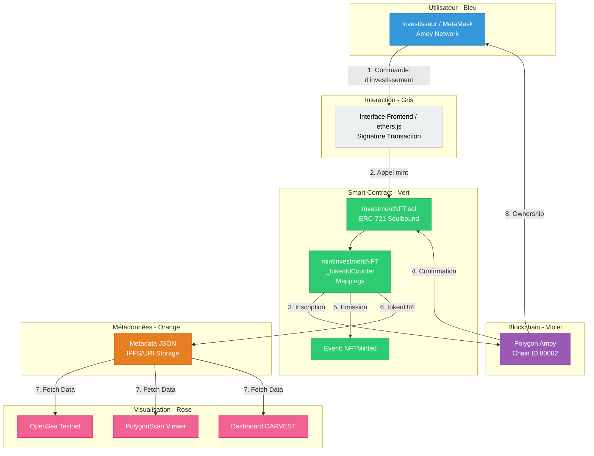
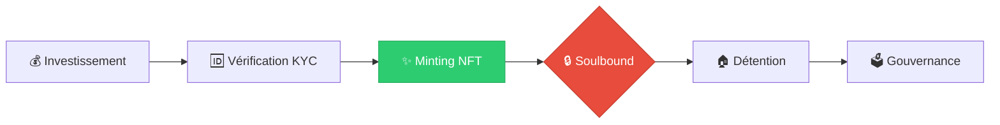

# Atelier 2 - Smart Contract NFT pour Investissements

## 🎯 Objectif
L'objectif de cet atelier est de comprendre comment les Jetons Non-Fongibles (NFT) peuvent être utilisés pour représenter des parts d'investissement et des droits de propriété numérique dans un projet réel comme **DARVEST**. 

Nous allons transformer une simple donnée d'investissement en un actif numérique unique, auditable et visuellement identifiable.

---

## 🖼️ Qu'est-ce qu'un NFT ?
Un **NFT (Non-Fungible Token)** est un jeton numérique unique stocké sur la blockchain. Contrairement aux jetons fongibles (comme le Bitcoin ou l'Ether), chaque NFT possède un identifiant propre qui le rend unique et non interchangeable. Dans le contexte de DARVEST, un NFT ne représente pas une image d'art, mais une **part d'investissement spécifique**.

---

## 📋 Fonctionnalités du Contrat NFT
- ✅ **Minting** : Création de NFTs représentant des investissements réels.
- ✅ **Données Financières** : Stockage immuable du montant investi lié à chaque jeton.
- ✅ **Soulbound (Sécurité)** : NFTs non-transférables pour garantir que la part reste liée à l'investisseur initial (conformité).
- ✅ **Métadonnées Standardisées** : Compatible avec les plateformes comme OpenSea.
- ✅ **Traçabilité Totale** : Historique complet de chaque part visible on-chain.

---

## 🏗️ Architecture

### Standard utilisé : ERC-721
Nous utilisons le standard industriel **ERC-721** d'OpenZeppelin. C'est le standard le plus utilisé pour les NFTs, garantissant que nos parts d'investissement peuvent être reconnues par n'importe quel portefeuille ou explorateur de blocs.

### 📊 Schéma d'Architecture Technique (Flux Complet)



### 🔄 Cycle de Vie du NFT dans DARVEST



### Modifications pour DARVEST
1. **Non-transférabilité** : Nous avons modifié la fonction `_update` pour bloquer les transferts entre portefeuilles. Cela transforme le NFT en jeton "Soulbound".
2. **Mapping d'investissement** : Ajout d'une structure de données interne pour lier chaque `tokenId` à un montant (`uint256`).

---

## 🚀 Installation
```bash
# Accéder au dossier
cd atelier2-nft-contract

# Installer les dépendances (Hardhat, OpenZeppelin, etc.)
npm install
```

---

## 🧪 Tests
Une suite de 20 tests valide la sécurité et les fonctionnalités du contrat.
```bash
npx hardhat test
```

---

## 📤 Déploiement sur Polygon Amoy
```bash
# Déploiement du contrat sur le testnet
npx hardhat run scripts/deploy.js --network amoy
```

---

## 🎨 Minting d'un NFT
```bash
# Créer votre première part d'investissement
npx hardhat run scripts/mint.js --network amoy
```

---

## 🔗 Liens Utiles
- **Polygon Amoy Faucet** : [https://faucet.polygon.technology/](https://faucet.polygon.technology/)
- **Amoy PolygonScan** : [https://amoy.polygonscan.com/](https://amoy.polygonscan.com/)
- **OpenSea Testnet** : [https://testnets.opensea.io/](https://testnets.opensea.io/)
- **ERC-721 Standard** : [EIP-721](https://eips.ethereum.org/EIPS/eip-721)

---

## 📊 Informations de Déploiement
- **Réseau** : Polygon Amoy (Chain ID: 80002)
- **Adresse du Contrat** : `0xc9FC208573Cd9e6f010129b779aaB4bcb3bC1C02`
- **Nom de la Collection** : DARVEST Investment Share
- **Symbole** : DINV

---

## 🔍 Comment Interagir

### 1. Via Amoy PolygonScan
- Recherchez l'adresse de votre contrat.
- Allez dans l'onglet **"Contract"**.
- Utilisez **"Read Contract"** pour voir le total minté ou le montant d'un ID.
- Utilisez **"Write Contract"** (connectez MetaMask) pour créer de nouvelles parts.

### 2. Via les Scripts
Utilisez `scripts/interact.js` pour lancer une série de tests d'interaction automatisés :
```bash
npx hardhat run scripts/interact.js --network amoy
```


---

## 💡 Pourquoi des NFTs pour DARVEST ?

### Avantages
- ✅ **Preuve de propriété** : Incontestable et mathématique.
- ✅ **Transparence** : Tout le monde peut auditer le nombre de parts émises.
- ✅ **Interopérabilité** : Votre investissement est visible dans votre portefeuille comme n'importe quel actif.
- ✅ **Programmabilité** : On peut ajouter des règles (ex: dividendes automatiques via le NFT).

### Cas d'usage DARVEST
- Chaque NFT = une part d'investissement dans un projet (ex: immobilier).
- Métadonnées : Contiennent le certificat de propriété et les détails du projet.

---

## 🆚 Différence avec Atelier 1

| Critère | Atelier 1 (Storage) | Atelier 2 (NFT) |
| :--- | :--- | :--- |
| **Standard** | Custom (Simple) | ERC-721 (Industriel) |
| **Représentation** | Un simple chiffre | Un objet numérique unique |
| **Transférable** | N/A | Non (Soulbound pour sécurité) |
| **Métadonnées** | Non | Oui (Nom, Image, Attributs) |
| **Interactivité** | Faible | Élevée (Marketplaces, Portefeuilles) |

---

## 📝 Apprentissages Clés
- Création d'un contrat **ERC-721** avec OpenZeppelin.
- Mise en place de métadonnées au standard OpenSea.
- Implémentation de la logique **Soulbound** (restriction de transfert).
- Visualisation d'actifs financiers sur des plateformes décentralisées.